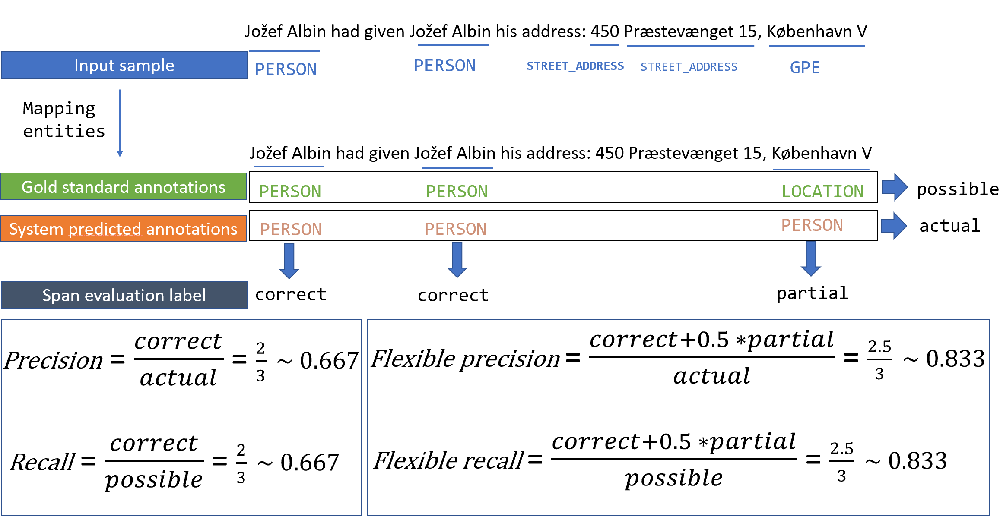

# Evaluation at the span level
Besides the evaluation metrics based on a token, this repository provides other scenarios at span level. 

## Evaluation Metrics
To be able to calculate the precision and recall, firstly we compare the golden standard annotations with the output of PII models, then define those different scenarios:

| Senario No | Description | Label |
| ---------- | ----------- | ----- |
| 1 | Entity type and spans are matched | correct |
| 2 | - Regardless of what the predicted entity is if the spans' boundaries overlapping ratio  is between [overlap_threshold, 1) (*)   - The spans' boundaries match precisely but the entity types is wrong | partial |
| 3 | Regardless of what the predicted entity is if the spans' boundaries overlapping ratio is between (0, overlap_threshold] (*)| incorrect |
| 4 | Regardless of the entity type, the spans' boundaries overlapping ratio is 0 | spurious |
| 5 | The span exist in gold standard annotation but doesn't exist in the predicted outcome | miss |

    (*) Spans' boundaries overlapping ratio = the number of intersecting character between gold and predicted spans / maximum number of characters between gold and predicted spans

    (*) overlap_threshold can be customize in each use case. If it is not providied, our evaluation uses the default value of 0.5

Then, we are able to calculate two more quantities from those labels:

<b>Possible</b>: The number of annotations in the gold-standard which contributes to the final score:
    Possible = correct + incorrect + partial + missed

<b>Actual</b>: The number of annotations produced by the PII detection system
    Actual = correct + incorrect + partial + spurious

### Metrics calculation for exact matching cases
    Precision = correct / actual

    Recall = correct / possible

### Metrics calculation for partial matching cases
   $$Precision = \frac{(correct + 0.5 * partial)}{actual}

    Recall = (correct + 0.5 * partial)/ possible

An example of the span-level evaluation is summarized in the following diagram:

