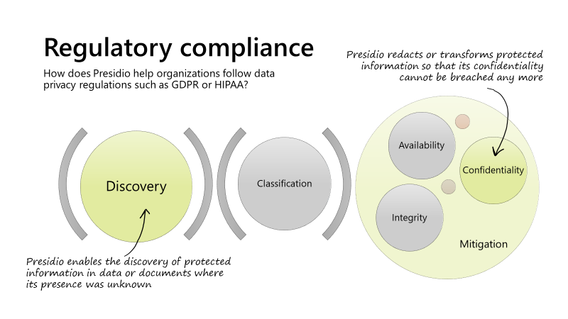

# Presidio and HIPAA

The [HIPAA US regulation](./hipaa-overview.md), with its HIPAA privacy rule, describes how and when data related to
individuals' health ([Protected Health Information, or PHI](./phi.md)) should be protected.
This document describes the capabilities that Presidio should have in order to be useful in an enterprise
program or office for HIPAA compliance in an organization.

Like other data privacy related regulations, such as GDPR, the implementation of a data protection tool such as Presidio
is a piece of the compliance picture, which also includes processes, controls, and other technology measures. In other
words, Presidio will not make an organization HIPAA compliant, but it can be extremely useful to the teams that establish and govern the compliance processes.

The general framework under which Presidio supports regulatory compliance efforts across the three stages
of discovering, classifying, and mitigating protected information is shown in the picture.

Within this framework, the two capabilities that Presidio can offer to a HIPAA compliance program are:

- *PHI discovery*, i.e. finding PHI within data or documents where it is not previously known to be present, using the data
itself to make decisions.
- *Irreversible removal*, i.e. removing the PHI from these data or documents in a way that it cannot be recovered,
to enable Safe Harbor protection scenarios.

Capabilities that Presidio will not offer, as they are not part of the project's core strategy, or they are present in
other tools are:

1. PHI discovery based on column or field names.
1. Statistical de-identification of data sets.

To provide these two capabilities above, Presidio needs to support the 18 PHI types listed [here](./phi.md). Detailed
requirements for each one of these data types and a review of current Presidio support for them can be found [here](./phi18.md).

Sources: [Source material](./source-material.md)
